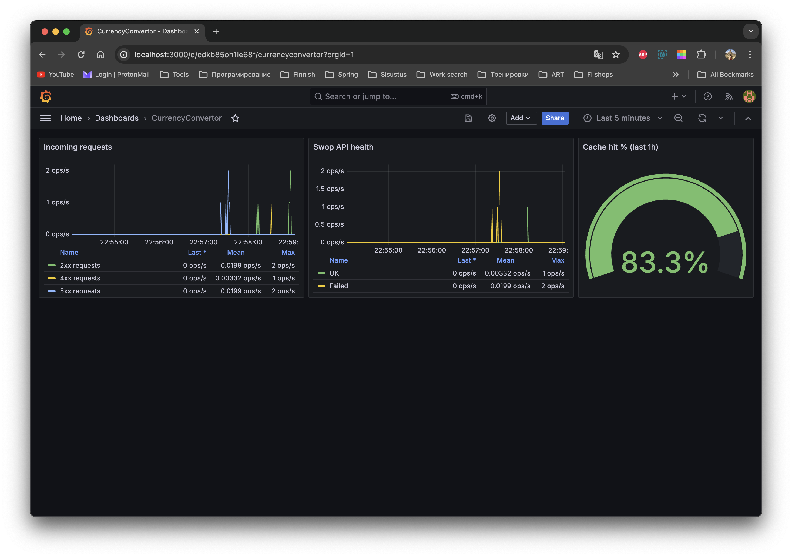
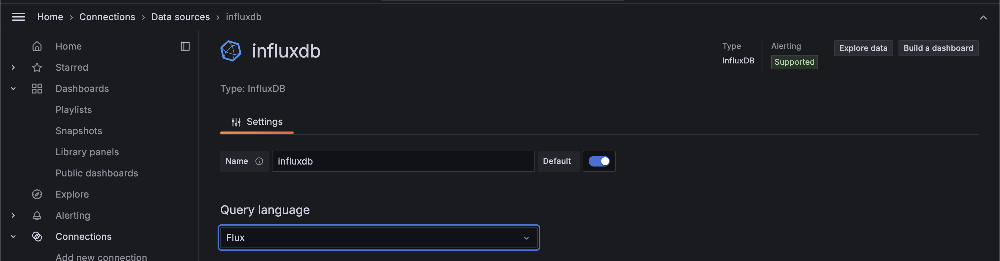

# Currency Converter
This is a simple currency converter that converts one currency to another. It uses the [SWOP-API](https://swop.cx/) to get the exchange rates. The application pplication built with Java, JavaScript, Spring Boot, and Vue.js.
## Project structure
The project is divided into two main parts:
   - The backend server, written in Java using the Spring Boot framework.
   - The frontend client, written in JavaScript using the Vue.js framework.
The backend server provides a REST API for fetching currency conversion rates. The frontend client provides a user interface for users to input their desired source currency, target currency, and monetary value, and then displays the conversion result.

## Backend server
The backend server is a simple Spring Boot application that provides a REST API for fetching currency conversion rates. The server fetches the exchange rates from the SWOP-API and caches them in memory for a configurable amount of time. The server exposes a single endpoint `/convert` that accepts a source currency, target currency, and monetary value as input and returns the converted monetary value as output.
It includes the following main components:  
   - CurrencyConvertorController.java: This is the main controller for the application. It handles HTTP requests and responses.
   - CurrencyRateService.java: This service is responsible for converting currencies.
   - InfluxDBClient.java: This client is used for interacting with the InfluxDB database.

## Running the application in Docker
Here's how the app can be run in the Docker container:
```bash
$ docker run -e API_KEY=your_api_key -e INFLUXDB_TOKEN=your_influxdb_token currency-convertor
```
In the above command, your_api_key and your_influxdb_token should be replaced with the actual API key and InfluxDB token.

## Grafana and InfluxDB

Grafana shows a simple dashboard with a few metrics collected from the app. The metrics are stored in InfluxDB.



### How to run

1. Start the InfluxDB and Grafana containers:
```bash
$ docker run -d -p 8086:8086 --name=influxdb influxdb:latest
$ docker run -d -p 3000:3000 --name=grafana grafana/grafana-enterprise
```
2. Create a Docker to connect the InfluxDB and Grafana containers:
```bash
$ docker network create influxGrafana
$ docker network connect influxGrafana grafana
$ docker network connect influxGrafana influxdb
```
3. Go to http://localhost:8086 and setup InfluxDB. Default values for the setup are:
    - Bucket: myBucket
    - Organization: currencyConvertor
    - Do not forget to add API token to the application.properties file.
    - Lookup the InfluxDB endpoint available for the Grafana container:
```bash
$ docker network inspect influxGrafana
// ...
            "e45b57fed441a3c024a1a3b69eee4991a38b3b36f33d51e5b6a19427318b3953": {
                "Name": "influxdb",
                "EndpointID": "65b43d2ace2f331cd824384c16e6cd29091c6bb7a664e90ffc8c55591101e921",
                "MacAddress": "02:42:ac:12:00:03",
                "IPv4Address": "172.18.0.3/16",
 // ...
```
In the example above, the InfluxDB IP is **172.18.0.3**
4. Go to http://localhost:3000 and setup Grafana:
    - Create a connector to InfluxDB
    - Make sure to choose the **Flux** query language 
    - No Basic Auth
    - Fill InfluxDB Details
    - 
    - Import the dashboard from `monitoring/grafana.json`
    - Note the DataSource UID (`ddkbsngx09ddsa`) needs to be updated in the JSON file. Simply change it on Grafana Import dashboard after loading the JSON. 
5. Set the correct values in the `application.properties` file, e.g.:
```properties
influxdb.token=Q5eo_o....
influxdb.bucket=myBucket
influxdb.org=currencyConvertor
influxdb.url=http://localhost:8086?timeout=5000&logLevel=BASIC
```
6. Run the application and check the metrics in Grafana.
